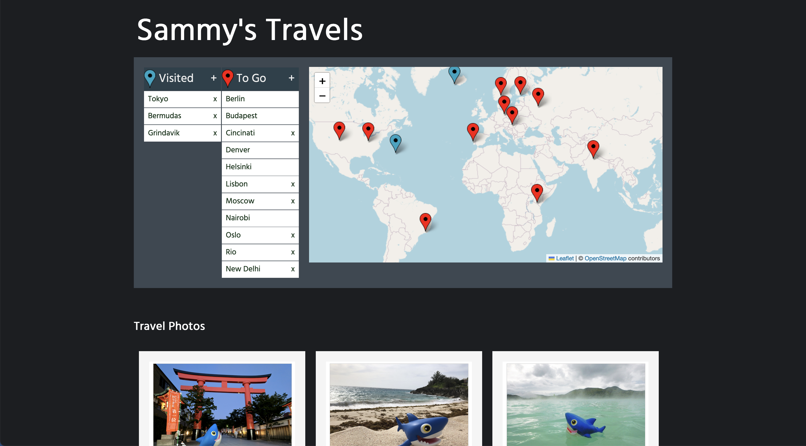
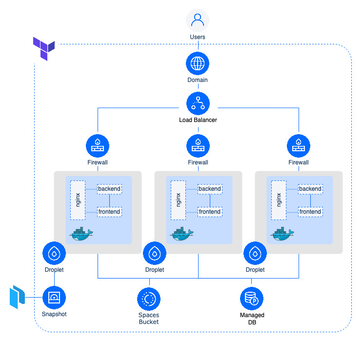

# Sammy's Travels

Sammy's Travels is a demo project used to showcase multiple technologies and ways of doing things, like infrastructure deployment on DigitalOcean via Terraform, Secret Storage on Doopler or creating [Distributed, Immutable and Ephemeral](https://www.youtube.com/watch?v=iO5d_tKwMfA) infrastructure. The project was inspired by the following [DigitalOcean community repo](https://github.com/do-community/travellist-laravel-demo) by @erikaheidi.



## Pre-requisites

- [docker compose](https://docs.docker.com/compose/install/). # For local development
- [DigitalOcean](https://cloud.digitalocean.com/login) account (Haven't got one? Start your [free trail](https://try.digitalocean.com/freetrialoffer/) now and grab $200 in credits.);
- [Doppler](https://www.doppler.com) account (There is a free tier for developer projects);
- [packer cli](https://developer.hashicorp.com/packer/tutorials/docker-get-started/get-started-install-cli);
- [terraform cli](https://developer.hashicorp.com/terraform/tutorials/aws-get-started/install-cli);
- A Domain you own [added to DigitalOceans' Domain section](https://docs.digitalocean.com/products/networking/dns/how-to/add-domains/) and the nameservers in your chosen domain registrar pointed towards DigitalOceans' own NS records([docs](https://docs.digitalocean.com/tutorials/dns-registrars/)).
- A container registry like [Docker Hub](https://hub.docker.com/) or [DigitalOcean's Container Registry](https://www.digitalocean.com/products/container-registry).

## Docker Compose

A [docker-compose.yml](./packer/sammys_travels/docker-compose.yml) file is used to run the application. The following provides a description of each of the components:

> - [nginx](https://nginx.org/) - an HTTP and reverse proxy server.
> - [db_migrate](https://github.com/golang-migrate/migrate) - a DB migration tool written in Go.
> - [backend](./backend/) - The backend of the website written in Go.
> - [frontend](./frontend/) - The frontend of the website written in React.

In addition to the above components, we will need somewhere to store our images, like a [Spaces bucket](https://www.digitalocean.com/products/spaces), and a [PostgreSQL database](https://www.postgresql.org/) to store information of the places Sammy has travelled, or wants to travel, to.

## Local Development

The application can be run locally by running a `docker compose up -d` command from the [local folder](./local/). This will build the `frontend`, `backend` and `db_migrate` containers from source as well as deploy a PostgreSQL database container and a [localstack](https://localstack.cloud/) container to simulate the bucket. Once the containers are up and running point your browser to [http://localhost](http://localhost) to access the application.

The only differences between the `docker-compose.yml` file used for local development and that used in production are disabling `sslmode` in the `db_migrate` container and the following environment variables used in the backend container:

```bash
  backend:
    ...
    environment: # Only needed for local development
      - DB_SSL_MODE=disable # SSL connection to the database disabled for local development
      - FORCE_PATH_STYLE=true # Forces bucket path to adhere to the following format http://localhost:4572/{bucket_name}
```

## Deploying on DigitalOcean

The project deploys the following architecture on DigitalOcean:


All of the above will be deployed on DigitalOcean and running on DigitalOcean [Droplets](https://www.digitalocean.com/products/droplets). A [Managed PostgreSQL Database](https://www.digitalocean.com/products/managed-databases-postgresql) is also used as well as a [Spaces](https://www.digitalocean.com/products/spaces) bucket for object storage. A Domain with SSL certificate, Load Balancer and a Firewall are also setup to ensure we can securely access the website from the web.

### Doopler

Secrets are managed and stored on [Doppler](https://www.doppler.com/). There are multiple ways to initially store secrets on Doppler but we will be using their terraform provider to store and subsequently access the secrets.

### Packer and Terraform

We will use [Packer](https://www.packer.io/) and [Terraform](https://www.terraform.io/) to automate the build and provision the resources.

## The Manual Part

- Create a DigitalOcean API token with read/write permissions ([docs](https://docs.digitalocean.com/reference/api/create-personal-access-token/))
- Create a DO Spaces access key and secret ([docs](https://docs.digitalocean.com/products/spaces/how-to/manage-access/#access-keys))
- Create a Doppler personal token, or service account if you are on the Team or Enterprise plan, for terraform ([docs](https://docs.digitalocean.com/products/spaces/how-to/manage-access/#access-keys))
- Create a Domain in DO and change nameservers in your domain registrar ([docs](https://docs.digitalocean.com/products/networking/dns/how-to/add-domains/))
- (_Optional_) If using Terraform Cloud to manage your state file, create a [user API token](https://app.terraform.io/app/settings/tokens)

## The (Semi-)Automated Part
_We're going to run some cli commands within our terminal which can be automated within a CI/CD process._

Once we've setup and created all of the above, clone the repository:
```bash
git clone https://github.com/digitalocean/supabase-on-do.git
cd supabase-on-do
```

1. Our first step is to push our [frontend](./frontend/), [backend](./backend/) and [db_migrate](./backend/db/) containers to our container registry.
2. Next is to build a snapshot of the Droplet we will be running, by following the documentation in the [packer directory](./infra/packer).
3. Finally we will deploy our resources using terraform as specified [here](./infra/terraform).

## Pushing images to a Container Registry

Each container needs to be pushed to a container registry so that the deployed Droplets can download the images and spin them up. The example below shows you how to do this to Docker Hub via the docker cli.

You will first have to login to docker by running the login command, substituting USER with your Docker Hub username.

```bash
docker login -u USER
```

From the directory containing the `Dockerfile` run the following command with the appropriate name for CONTAINER_NAME (for example be-sammys-travels for the backend container)

```bash
docker build -t <CONTAINER_NAME> .
```

Then tag and push the image to the container registry substituting for USER and TAG, where TAG can be the version number of your build.

```bash
docker image tag <CONTAINER_NAME> <USER>/<CONTAINER_NAME>:<TAG>
docker image push <USER>/<CONTAINER_NAME>:<TAG>
```